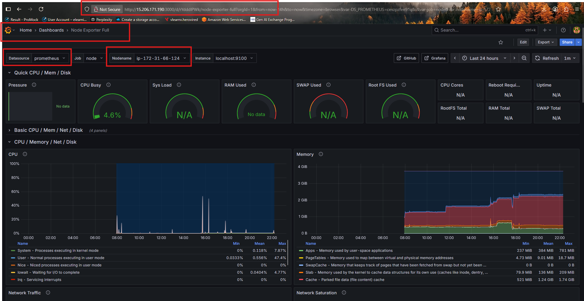

# End-to-End MERN Deployment & Monitoring

## Objective

Deploy and monitor a MERN app using Terraform, Ansible, Prometheus & Grafana with AWS infrastructure.

## Results:

### Terraform_Provisioning: 

----------------------------------------------------------------------------------------------------------------------------------------------------------------------------------------------------------------------------------


### Ansible configuration:
----------------------------------------------------------------------------------------------------------------------------------------------------------------------------------------------------------------------------------


### App Webserver on AWS console:
----------------------------------------------------------------------------------------------------------------------------------------------------------------------------------------------------------------------------------


### App Webserver Frontend Home:
----------------------------------------------------------------------------------------------------------------------------------------------------------------------------------------------------------------------------------


### App Webserver Frontend to Backend Communication via Nginx:
----------------------------------------------------------------------------------------------------------------------------------------------------------------------------------------------------------------------------------


### Prometheus Targets:
----------------------------------------------------------------------------------------------------------------------------------------------------------------------------------------------------------------------------------


### Prometheus-Grafana Connection:
----------------------------------------------------------------------------------------------------------------------------------------------------------------------------------------------------------------------------------


### Node_Exporter Grafana Dashboard:
----------------------------------------------------------------------------------------------------------------------------------------------------------------------------------------------------------------------------------



### MongoDB Grafana Dashboard:
----------------------------------------------------------------------------------------------------------------------------------------------------------------------------------------------------------------------------------


### Alert Rule Grafana:
----------------------------------------------------------------------------------------------------------------------------------------------------------------------------------------------------------------------------------


## Application Repo

[TravelMemory](https://github.com/UnpredictablePrashant/TravelMemory)

## EC2 Instances

| Service         | EC2 name   | 
| --------------- | ---------- |
| MERN Web Server | web-server |
| MongoDB Server  | db-server  |

## Ports

| Service    | Ports                                       |
| ---------- | --------------------------------------------|
| Web Server | 22, 80, 443, 9100, 9090, 9216               |
| DB Server  | 22, 27017, 9216 (from web server)           |

## Architecture Diagram

```
+-------------------------------+           +----------------+
| MERN Web Server               | --------> | MongoDB Server |
| (Node.js/React+ node exporter)|           | (MongoDB + Exp)|
+-------------------------------+           +----------------+
         |
         v
  +--------------+
  |  Prometheus  |
  +--------------+
         |
         v
   +------------+
   |  Grafana   |
   +------------+
```
## Common Commands

**Terraform:**

```
terraform init
terraform plan
terraform apply
terraform destroy
terraform output
```

**Ansible:**

```
ansible-playbook -i inventory.ini main.yml

```

**Node.js/Frontend:**

```
npm install
npm run build
```

## Quick Q\&A

| Q                      | A                                            |
| ---------------------- | -------------------------------------------- |
| What is `prom-client`? | Node.js lib to expose metrics for Prometheus |
| MongoDB Exporter?      | Collects DB metrics for Prometheus           |
| Restrict DB access?    | Security groups allow only web server IP     |
| Separate EC2 for DB?   | Security & scalability                       |
| Grafana alerts?        | Notify on errors, slow APIs, DB issues       |


## Environment variable

`.env` file to work with the backend after creating a database in mongodb: 

```
MONGO_URI='ENTER_YOUR_URL'
PORT=3001
```


For frontend, you need to create `.env` file and put the following content (remember to change it based on your requirements):
```bash
REACT_APP_BACKEND_URL=http://localhost:3001
```
